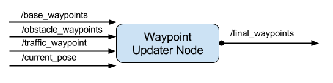
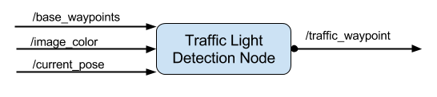

## Waypoint Updater


### Subscribed to Topics:
`/base_waypoints`

`/obstacle_waypoints`

`/traffic_waypoints`

`/current_pose`

### Publish Topic:
`/final_waypoints`


## DBW


### Subscribed to Topics:
`/current_velocity`

`/twist_cmd`

`/vehicle/dbw_enabled`

### Publish Topics:

`/vehicle/throttle_cmd`

`/vehicle/steering_cmd`

`/vehicle/brake_cmd`


## Traffict Light Detection


### Subscribed to Topics:
`/base_waypoints`

`/image_color`

`/current_pose`

### Publish Topic:
`/traffic_waypoint`


[More information about the message type of each Topic](TopicInfo.md)

## Darknet
### launch.tcl
catkin_make __-DCMAKE_BUILD_TYPE=Release__

### ros/launch/styx.launch
ADD Darknet ROS Node into frame work
```
<!--Darknet ROS Node -->
<include file="$(find darknet_ros)/launch/yolo_v3.launch"/>
```

### ros/src/darknet_ros
add `LICENSE`,  `README.md`, `darknet`, `darknet_ros/CHANGELOG.rst`
'''
