# Topic information

|Topics|msg Type|Publishers|Subscribers|
|:----:|:------:|:--------:|:---------:|
|[`/base_waypoints`](#bw)|[`Lane`](#L)|	`Waypoint Loader`|`tl_detector` `waypoint_updater`|
|[`/current_pose`](#cp)|[`PoseStamped`](#PS)|
|[`/current_velocity`](#cv)|[`TwistStamped`](#TS)|
|[`/final_waypoints`](#fw)|[`Lane`](#L)|
|[`/image_color`](#ic)|[`Image`](#T)|
|[`/tf`](#tf)|[`tfMessage`](#M)|
|[`/traffic_waypoint`](#tw)|[`Int32`](#32)|
|[`/twist_cmd`](#tc)|[`TwistStamped`](#TS)|
|[`/vehicle/dbw_enabled`](#de)|[`Bool`](#B)|
|[`/vehicle/brake_cmd`](#bc)|[`BrakeCmd`](BC)|
|[`/vehicle/steering_cmd`](#sc)|[`SteeringCmd`](#SC)|
|[`/vehicle/throttle_cmd`](#thc)|[`ThrottleCmd`](#TC)|
|[`/vehicle/traffic_lights`](#tl)|[`TrafficLightArray`](#TLA)|

## `/base_waypoints`
- msg Type: [[`Lane`](#L)
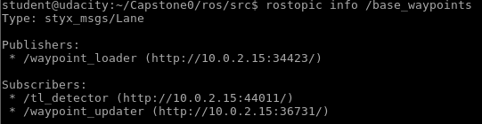

[Back to Table](#table)

## `/current_pose`
- msg Type: [`PoseStamped`](#PS)

[Back to Table](#table)

## `/current_velocity`
- msg Type: [`TwistStamped`](#TS)

[Back to Table](#table)

## `/final_waypoints`
- msg Type: [`Lane`](#L)

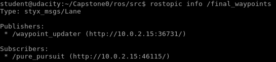

[Back to Table](#table)

## `/image_color`
- msg Type: [`Image`](#I)

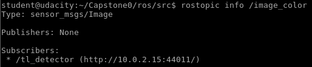

`/rosout`

`/rosout_agg`

[Back to Table](#table)

## `/tf`
- msg Type: [`tfMessage`](#M)

[Back to Table](#table)

## `/traffic_waypoints`
- msg Type: [`Int32`](#32)

[Back to Table](#table)

## `/twist_cmd`
- msg Type: [`TwistStamped`](#TS)

[Back to Table](#table)

## `/vehicle/dbw_enabled`
- msg Type: [`Bool`](#B)

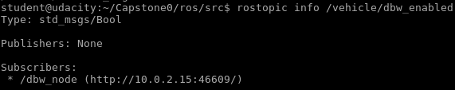

[Back to Table](#table)

## `/vehicle/throttle_cmd`
- msg Type: [`ThrottleCmd`](#TC)

[Back to Table](#table)

## `/vehicle/steering_cmd`
- msg Type: [`SteeringCmd`](#SC)

[Back to Table](#table)

## `/vehicle/brake_cmd`
- msg Type: [`BrakeCmd`](#BC)

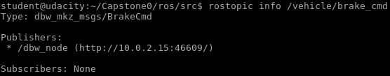

[Back to Table](#table)

## `/vehicle/traffic_lights`
- msg Type: [`TrafficLightArray`](#TLA)

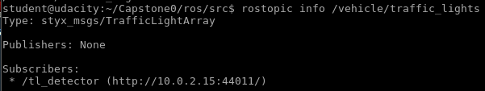

`/obstacle_waypoints`

# Message Structure

[Back to Table](#table)

## `Lane`				
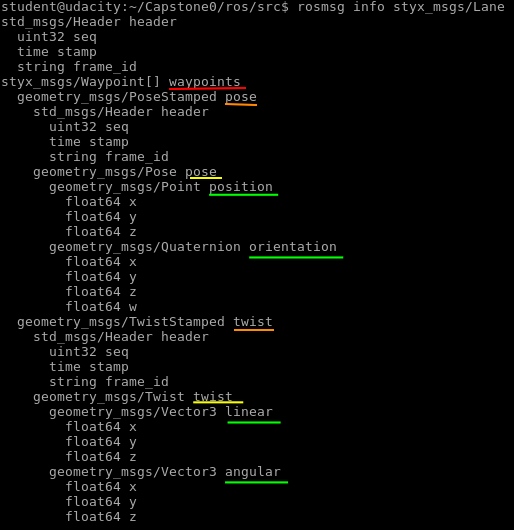

[Back to Table](#table)

## `PoseStamped`
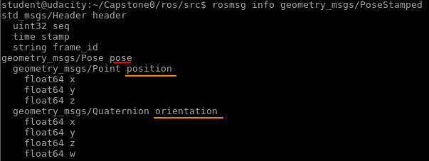

[Back to Table](#table)

## `TwistStamped`
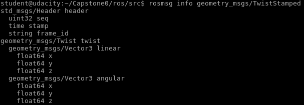

[Back to Table](#table)

## `Image`

[Back to Table](#table)

## `tfMessage`
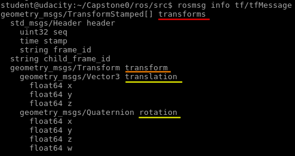

[Back to Table](#table)

## `Int32`

[Back to Table](#table)

## `Bool`
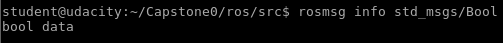

[Back to Table](#table)

## `ThrottleCmd`

[Back to Table](#table)

## `SteeringCmd`

[Back to Table](#table)

## `BrakeCmd`

[Back to Table](#table)

## `TrafficLightArray`
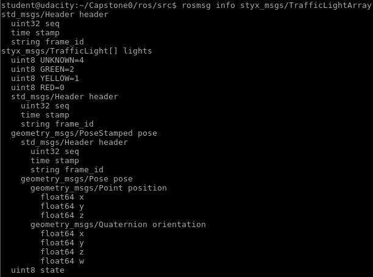

[Back to Table](#table)

