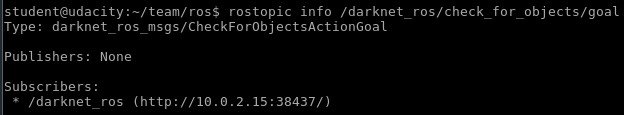
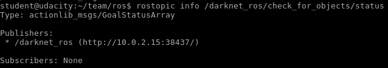
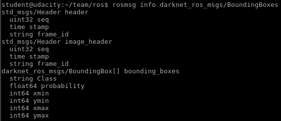
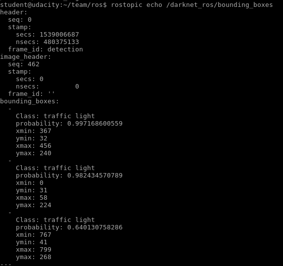
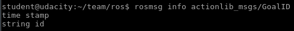
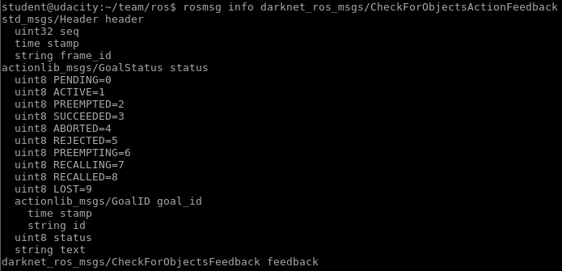
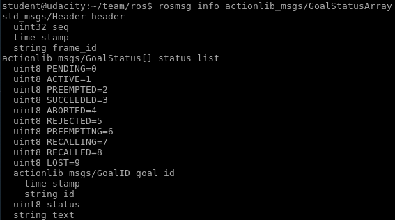

# Topic in `/darknet_ros`

|Topics|msg Type|Publishers|Subscribers|
|:----:|:------:|:--------:|:---------:|
|[/bounding_boxes](#bb)|[`BoundingBoxes`](#BB)|`/darknet_ros`|`/tl_detector`|
|[/check\_for_objects/result](#r)|[`CheckForObjectsActionResult`](#R)|`/darknet_ros`|None|
|[/check\_for_objects/cancel](#c)|[`CheckForObjectsActionCancel`](#C)|None|`/darknet_ros`|
|[/check\_for_objects/feedback](#f)|[`CheckForObjectsActionFeedback`](#F)|`/darknet_ros`|None|
|[/check\_for_objects/goal](#g)|[`CheckForObjectsActionGoal`](#G)|None|`/darknet_ros`|
|[/check\_for_objects/status](#s)|[`CheckForObjectsActionStatus`](#S)|`/darknet_ros`|None|

## `/bounding_boxes`
- msg Type: [`BoundingBoxes`](#BB)

[Back to Table](#table)

## `/check_for_objects/result`
- msg Type: [`CheckForObjectsActionResult`](#R)

[Back to Table](#table)

## `/check_for_objects/cancel`
- msg Type: [`actionlib_msgs/GoalID`](#C)

[Back to Table](#table)

## `/check_for_objects/feedback`
- msg Type: [`CheckForObjectsActionFeedback`](#F)

[Back to Table](#table)

## `/check_for_objects/goal`
- msg Type: [`CheckForObjectsActionGoal`](#G)

[Back to Table](#table)

## `/check_for_objects/status`
- msg Type: [`actionlib_msgs/GoalStatusArray`](#S)

[Back to Table](#table)

# Message Structure in `darknet_ros_msgs`

## `BoundingBoxes`

				

[Back to Table](#table)

## `CheckForObjectsActionResult`

[Back to Table](#table)

## `CheckForObjectsActionCancel`

[Back to Table](#table)

## `CheckForObjectsActionFeedback`

[Back to Table](#table)

## `CheckForObjectsActionGoal`

[Back to Table](#table)

## `CheckForObjectsActionStatus`

[Back to Table](#table)